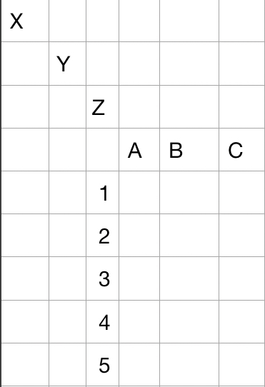
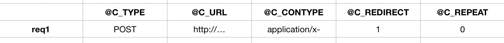
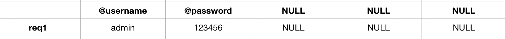
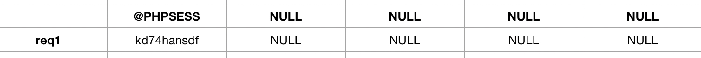
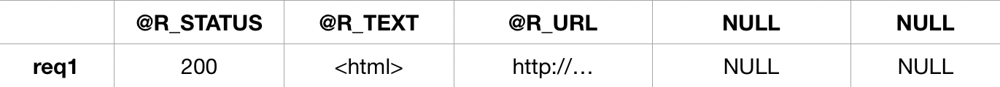

# webtensor

The use of this module may look complicated at first, but let me assure you:
The mechanism is simple and the tool very powerful.

## 1) Datasets (Tensor notation and manipulation)

#### All console commands (to be extended):
---
__Create__ a new dataset where mydataset is its name:

	dataset create mydataset
 
__Remove__ a new dataset where mydataset is its name:

	dataset remove mydataset

__Set__ data in your dataset:

	dataset set mydataset --index=1,2,3 --value=word

__Read__ data in your dataset:

	dataset read mydataset --index=1,2,3 --value=word

__Load__ data into your dataset from a .wmtrx.json file:

	dataset load --in=mydata.tensor.json

__Export__ your dataset:

	dataset export mydataset --out=newdata.tensor.json

__Extract__ a lower dimensional array from your dataset:

	dataset extract mydataset[1][][] —-out=myextracteddata.json

__(TBD) Visual edit__ of your dataset:

	dataset visualedit mydataset
 
#### Dataset structure:
---
Different from a standard matrix form, we use labels at three neighboring edges and on three neiboring surrounding planes. Like a dictionary, you can access its content, by using those parameters, just a bit more difficult.
For computation speed purposes, the data is stored in index-notation.

Example of a structure of a standard dataset:

Where A, B, C, X, Y, Z, 1, 2, 3 are any variables.
Access of this matrix is explained later.

#### Example for crawl-tensors: 
---

Example of a structure of a dataset that can be used for crawling:

>_The directions A, B, C, … are used for categorisation_
>_The directions X, Y, Z, … have no relation in this specific case_
>_Instead, plane labels are used. To prevent confusion, they are written with {}_

``dataset extract mydataset[“CRAWL_PARAMS“][][] —-out=myextracteddata.csv``

``dataset extract mydataset[“CRAWL_ARGS“][][] —-out=myextracteddata.csv``

#### Accessing values:
---
Example for accessing the value ’url‘ with its labels:

``matrix[“CRAWL_PARAMS“]{“C_URL“}[“req1“]``

alternatively with indices
``matrix[1][2][1]``

or a combination
``matrix[1][2][“req1“]``

Important Note: From this notation, __C_URL__ is not an edge label. To access a value with a plane label, you have to use {} brackets like in the example above.

#### Dataset storage in .json format:
---
As mentioned before, data is stored in index notation (mainly for computation speed purposes and simplicity in transformations). For identification purposes, data is stored as .tensor.json.

``mydata.tensor.json``

	[
		# EDGE LABELS
		[0, -1, -1, “CRAWL_PARAMS“],
		[1, -1, -1, “CRAWL_ARGS“],
		
		# PLANE LABELS
		[0, 0, -1, “C_TYPE“],
		[0, 1, -1, “C_URL“]
		[0 2, -1, “C_CONTYPE“],
		[0, 3, -1, “C_REDIRECT“],
		[1, 0, -1, “username“],
		[1, 1, -1, “password“],
		
		# CONTENT
		[0, 0, 0, “POST“],
		[0, 1, 0, “http://…“],
		(0, 2, 0, “application/x…“],
		[0, 3, 0, 1],
		[1, 0, 0, “admin“],
		[1, 1, 0, “123456“]
	
	]

#### Special behavior of tensors:
---
There are multiple uncommon behaviors, that need to be mentioned in order to understand these tensors well.

	- tensor[2]{‘data‘}[3] 
	If ‘data‘ is not a plane label yet, a plane label will be created, as long as there are enough free ones. This behavior is similar to dict-objects.
	- tensor.size(), gives a list object [1, 7, 4] with the number of instances in each direction.
	- tensor[3][][] gives back a LIST object (!) in form of a matrix (list in lists). This has the effect, that it can be converted more easily into csv…
	- tensor[3][4][-1] gives back a plane LABEL
	- tensor[1,3,25] extends a [1,1,1] tensor to a size of [1,3,25]
	

## 2) Crawler workflow and cell notation

#### Commands
---
__Crawl with__ a dataset:
	``crawlwith mydataset``

#### Workflow
---
A dataset has to have the following __minimum requirements__ for it to work:
- The single web requests must be listed as an iteration of the third coordinate.
- The first access variable has to contain: crawler-settings, crawler-arguments, crawler-cookies, crawler-response

The crawler goes through the following steps:
- Pre-process the crawler-settings, crawler-arguments and crawler-cookies by using the cell operation technique.
- Make the request.
- Write response parameters in the pre-defined cells.
- Continue to next request.

#### Structure of a crawler-dataset
___

For illustration purposes, this documentation shows the tensor split in matrices, by the first coordinate:

__[0] CRAWL_PARAMS__:

__[1] CRAWL_ARGS__:

__[2] CRAWL_COOKIES__:

__[3] CRAWL_RESP__:

#### Cell notation and pre-processing
---

> _Note that the following methods restrict the full capability of this datatype, but with the price of great simplicity._

Every cell will have string values with a string keyword in front:
``s:admin``
The function of the keyword or keyletter in front of the actual value determines what happens to that value and can be interpreted by this table:

- ``s:[string]``
	s (set) uses the variables as it is
	
- ``i:[string]``
	i (input) requests an input during the crawl process and stores the value at that cell. The use case of that is mainly for 2FA.
	
- ``r:r:[a,b,c]:[string]``
	r (regular expression) calls a regex-search-group operation on a previous cell (relative distance)
	 
- ``r:a:[a,b,c]:[string]``
	r (regular expression) calls a regex-search-group operation on a previous cell (relative distance) 
	
- ``d:[%d-%m-%Y]``
	d (date) stores the current date in the given format

