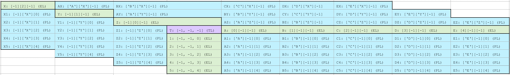

# webtensor

The use of this module may look complicated at first, but let me assure you:
The mechanism is simple and the tool very powerful.

## 1. Datasets (Console notation and manipulation)

### All console commands (to be extended):

---

__Create__ a new dataset where mydataset is its name:

    dataset create mydataset

__Remove__ a new dataset where mydataset is its name:

    dataset remove mydataset

__List__ datasets:

    dataset list

__Set__ data in your dataset:

    dataset set mydataset --index=1,2,3 --value=word

__Read__ data in your dataset:

    dataset read mydataset --index=1,2,3 --value=word

__Load__ data into your dataset from a .wmtrx.json file:

    dataset load --in=mydata.tensor.json

__Export__ your dataset:

    dataset export mydataset --out=newdata.tensor.json

__Extract__ a lower dimensional array from your dataset:

    dataset extract mydataset[1][][] —-out=myextracteddata.json

__(TBD) Visual edit__ of your dataset:

    dataset visualedit mydataset

### Dataset structure:

---

Different from a standard matrix form, we use labels at three neighboring edges and on three neiboring surrounding planes. Like a dictionary, you can access its content, by using those parameters, just a bit more difficult.
For computation speed purposes, the data is stored in index-notation.

Example of a structure of a standard dataset:

Where A, B, C, X, Y, Z, 1, 2, 3 are any variables.
Access of this matrix is explained later.

### Example for crawl-tensors:

---

Example of a structure of a dataset that can be used for crawling:

> _The directions A, B, C, … are used for categorisation_
> _The directions X, Y, Z, … have no relation in this specific case_
> _Instead, plane labels are used. To prevent confusion, they are written with {}_

``dataset extract mydataset[“CRAWL_PARAMS“][][] —-out=myextracteddata.json``

``dataset extract mydataset[“CRAWL_ARGS“][][] —-out=myextracteddata.json``

### Accessing values:

---

Example for accessing the value ’url‘ with its labels:

``matrix[“CRAWL_PARAMS“][[“C_URL“]][“req1“]``

alternatively with indices
``matrix[1][2][1]``

or a combination
``matrix[1][2][“req1“]``

Important Note: From this notation, __C_URL__ is not an edge label. To access a value with a plane label, you have to use [[...]] double brackets like in the example above.

### Dataset storage in .json format:

---

As mentioned before, data is stored in index notation (mainly for computation speed purposes and simplicity in transformations). For identification purposes, data is stored as .tensor.json.

``mydata.tensor.json``

    [
	  # EDGE LABELS
	  [0, -1, -1, "CRAWL_PARAMS"],
	  [1, -1, -1, "CRAWL_ARGS"],
	  [2, -1, -1, "CRAWL_COOKIES"],
	  [3, -1, -1, "CRAWL_RESP"],

	  # PLANE LABELS
	  [0, 0, -1, "C_TYPE"],
	  [0, 1, -1, "C_URL"],
	  [0, 2, -1, "C_CONTYPE"],
	  [0, 3, -1, "C_REDIRECT"],
	  [0, 4, -1, "C_REPEAT"],

	  [1, 0, -1, "example_argument"],
	  [2, 0, -1, "example_cookie"],

	  [3, 0, -1, "R_STATUS"],
	  [3, 1, -1, "R_TEXT"],
	  [3, 2, -1, "R_URL"]

	  # DATA
	  [0, 0, 0, "s:GET"],
	  [0, 1, 0, "s:https://example.org"],
	  [0, 2, 0, "s:application/x-form-urlencoded"],
	  [0, 3, 0, "s:1"],
	  [0, 4, 0, "s:"],
	  [1, 0, 0, "s:example_value"],
	  [2, 0, 0, "s:example_cookie_value"]
	]

### Special behavior of tensors in raw python:

---

There are multiple uncommon behaviors, that need to be mentioned in order to understand these tensors well.

``tensor[2][[‘data‘]][3]``
	If ‘data‘ is not a plane label yet, a plane label will be created, as long as there are enough free ones. This behavior is similar to dict-objects.

``len(tensor)``
	Gives back a list object [1, 7, 4] with the number of instances in each direction.

``tensor[3][None][None]``
	Gives back a LIST object (!) in form of a matrix (list in lists). This has the effect, that it can be converted more easily into csv and other common data formats.

``tensor[3][4][-1]``
	Gives back a plane LABEL.

``tensor[1][3][25] = 'value'``
	Extends a [1,1,1] tensor to a size of [1,3,25].

``tensor[1][3]``
	Is an invalid notation and will raise an error. Notation like that may be possible in a future update.

``tensor[1][][]``
	Is an invalid notation in python and will raise a syntax error.

## 2. Crawler workflow and cell notation

### Commands:

---

__Crawl with__ a dataset:

    crawlwith mydataset
    crawlwith mydataset --debug

### Workflow:

---

A dataset has to have the following __minimum requirements__ for it to work:

- The single web requests must be listed as an iteration of the third coordinate.
- The first access variable has to contain: crawler-settings, crawler-arguments, crawler-cookies, crawler-response

The crawler goes through the following steps:

- Pre-process the crawler-settings, crawler-arguments and crawler-cookies by using the cell operation technique.
- Make the request.
- Write response parameters in the pre-defined cells.
- Continue to next request.

### Structure of a crawler-dataset:

---

For illustration purposes, this documentation shows the tensor split in matrices, by the first coordinate:

__[0] CRAWL_PARAMS__:

__[1] CRAWL_ARGS__:

__[2] CRAWL_COOKIES__:

__[3] CRAWL_RESP__:

### Cell notation and pre-processing:

---

> _Note that the following methods restrict the full capability of this datatype, but with the price of great simplicity._

Every cell will have string values with a string keyword in front:
``s:admin``
The function of the keyword or keyletter in front of the actual value determines what happens to that value and can be interpreted by this table:

- ``s:[string]``
  s (set) uses the variables as it is
- ``i:[string]``
  i (input) requests an input during the crawl process and stores the value at that cell. The use case of that is mainly for 2FA.
- ``r:r:[a,b,c]:[regex]``
  r (regular expression) calls a regex-search-group operation on a previous cell (relative distance)
- ``r:a:[a,b,c]:[regex]``
  r (regular expression) calls a regex-search-group operation on a previous cell (absolute distance) and writes it to itself
- ``p:r/a:[a,b,c]:[x,y,z]:[regex]``
  p (projection) Applies regex on a cell [a, b, c] and writes it to [x,y,z]
- ``x:r/a:[a,b,c]:[path]:[attribute]``
  x (xpath) Applies xpath on a cell [a, b, c] and writes it to itself. If the attribute is empty, innerHTML will be returned.
- ``d:[%d-%m-%Y]``
  d (date) stores the current date in the given format
- ``o:r/a:[a,b,c]``
  o (out) writes a specific value at runtime to the console

## 3. Python 'dataset' datatype

> _As there are a lot of modules called 'tensor', and tensors are in fact multidimensional arrays,
the name of this module will be 'dataset'. Not every feature has been implemented yet. See future
releases for full capability and increased speed._

__Python code example:__

	from dataset import Dataset

	d = Dataset()
	d0 = Dataset(zero=True)

	# -----------
	# Set a value to a cell/Read a cell  with numeric indices

	d[1][0][1] = 'my text here'
	d0[1][0][1] = d[1][0][1]

	print(d[1][0][1])
	>>> 'my text here'

	print(d[1][1][1])
	>>> ValueError

	print(d0[1][1][1])
	>>> 0

	# ----------
	# Extract list-in-list arrays from a dataset

	print(d[any][any][any])
	print(d.extract())
	>>> [[[0, ...],...], [[0, ...], ...], ... ]

	print(d[1][2][any])
	>>> [1, 2, 3, 4]

	print(d[4][any][any])
	>>> [[1, 2, 3], [4, 5, 6]]

	# Set data as lower dimensional array
	d[4][any][any] = [[1, 2, 3], [4, 5, 6]]

	d[1][2][any] = [1, 2, 3, 4]	

	# ----------	
	# Set values/labels to a cell/read cells with..
	# ... edge labels (EL)

	d[1][-1][-1] = 'EL1'
	d[1][any][any] = 'EL1'

	print(d['EL1'][0][1])
	>>> 'my text here'

	# ...  plane labels (PL)
	d[1][2][any] = 'PL1'
	d[1][2][-1] = 'PL1'

	d[1]['PL'][5] = 3
	d['PL'][2][5] = 3

	# -----------
	# Extract sliced data

	d[1][2][0:3] = [9, 8, 7]

	print(d[1][2][1:4])
	>>> [8, 7, 4]

	# ------------
	# Get dataset size
	
	len(d)
	>>> [3, 4, 5]

	len(d[3][None][2])
	>>> 2

	len(d[3][any][any])
	>>> [1, 2]
	

	# ------------
	# Iterate through a dataset

	for x, y, z in d:
		print("{x}, {y}, {z}, ".format(), end='')
	>>> [0, 0, 0] [0, 0, 1] ...

	for a, b in d[1][any][any]:
		print("[{a}, {b}], ".format(), end='')
	>>> [0, 0] [0, 1] ...

	for k in d[1][1][any]:
		print('{k}, ', end='')
	>>> 1, 2, 3, 4

